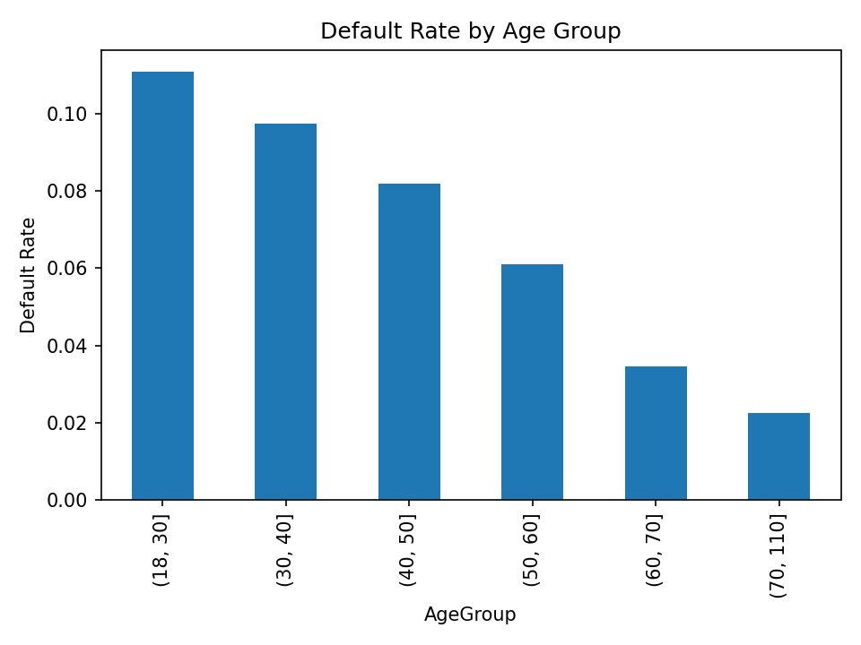
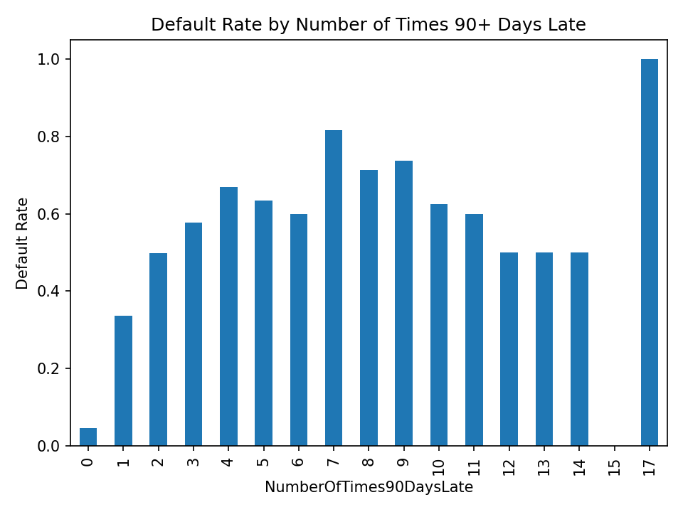
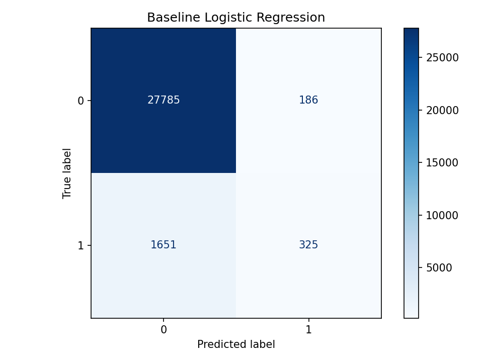
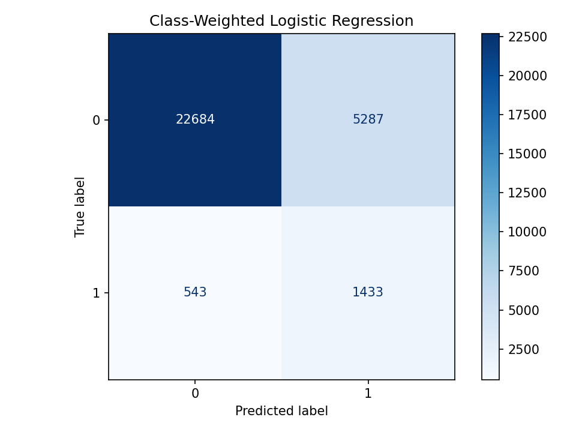
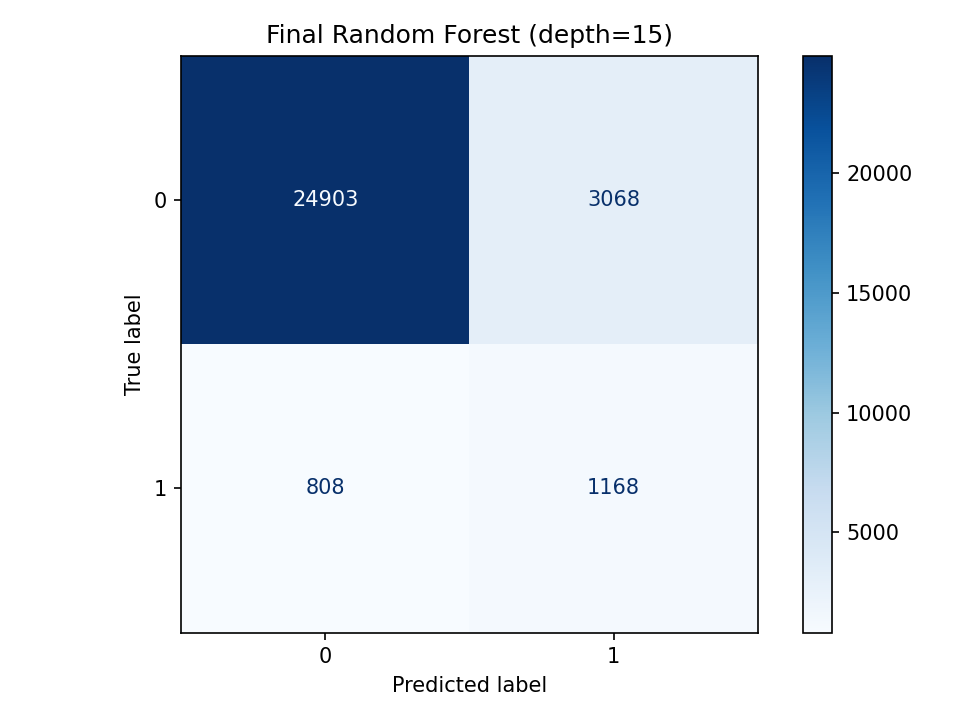

# 💳 Loan Default Risk Predictor

<p align="center">
  
  
  
  
</p>

<p align="center">
  <b>An end-to-end machine learning project that predicts the probability a loan applicant will default within 2 years — from raw, messy data to a live, deployed risk-assessment tool.</b>
</p>

<p align="center">
  🔗 <a href=https://default-risk-ml.streamlit.app/><b>Try the live app</b></a> &nbsp;|&nbsp;
  📓 <a href=["week_6_capstone.ipynb"](https://github.com/arhamrizwan2006/neurofive-ml-track/blob/main/Week_6_Capstone/Final_CapStone_Project.ipynb)><b>View the notebook</b></a>
</p>

---

## 📌 Table of Contents
- [Overview](#-overview)
- [The Dataset](#-the-dataset)
- [Data Cleaning](#-data-cleaning)
- [Exploratory Data Analysis](#-exploratory-data-analysis)
- [Feature Engineering](#-feature-engineering)
- [Modeling & Results](#-modeling--results)
- [Deployment](#-deployment)
- [Tech Stack](#-tech-stack)
- [Project Structure](#-project-structure)
- [Run It Locally](#-run-it-locally)
- [Key Takeaways](#-key-takeaways)

---

## 🎯 Overview

Lenders face a constant, high-stakes question: **will this applicant pay back their loan?** Approve too freely and bad debt piles up; decline too cautiously and good customers walk away. This project builds a machine learning pipeline that estimates the probability an applicant will experience **serious delinquency (90+ days late) within the next 2 years**, based on their financial profile and payment history — turning a real risk-assessment problem into a working, interactive tool.

This was built as the capstone project for the **Neurofive Solutions ML Fundamentals internship**, intended to demonstrate the full pipeline: cleaning real-world messy data → exploratory analysis → model comparison → feature engineering → a production-style deployed app.

## 📊 The Dataset

**Source:** [Give Me Some Credit](https://www.kaggle.com/c/GiveMeSomeCredit) (Kaggle)
**Size:** ~150,000 records, 11 features
**Target:** `SeriousDlqin2yrs` (binary: 1 = defaulted, 0 = did not)

| Feature | Description |
|---|---|
| `RevolvingUtilizationOfUnsecuredLines` | Credit card / line-of-credit balance relative to limit |
| `age` | Applicant's age |
| `NumberOfTime30-59/60-89/90+DaysLate` | Times payments were late, by severity |
| `DebtRatio` | Monthly debt payments ÷ monthly income |
| `MonthlyIncome` | Applicant's monthly income |
| `NumberOfOpenCreditLinesAndLoans` | Open credit accounts |
| `NumberRealEstateLoansOrLines` | Mortgages / real estate loans |
| `NumberOfDependents` | Number of dependents |

## 🧹 Data Cleaning

Real financial data is never clean out of the box. Here's what was found and fixed:

<details>
<summary><b>🔎 Sentinel/placeholder codes (269 rows)</b></summary>
<br>

The three late-payment columns contained suspicious values of **96 and 98** — far outside the realistic 0–17 range seen elsewhere. Checking their distribution revealed the *exact same* row counts (5 and 264) repeated identically across all three independent columns — strong evidence these were leftover placeholder codes from the source system, not real data. All 269 affected rows were dropped.
</details>

<details>
<summary><b>🔎 Invalid age value</b></summary>
<br>

One row had `age = 0` — a clear data entry error, since the rest of that row looked entirely normal. Fixed with median imputation rather than dropping the row.
</details>

<details>
<summary><b>🔎 Missing values</b></summary>
<br>

`MonthlyIncome` (~20% missing) and `NumberOfDependents` (~2.6% missing) were filled using median imputation — chosen over the mean since both distributions are right-skewed.
</details>

<details>
<summary><b>🔎 Extreme outliers in ratio columns</b></summary>
<br>

`RevolvingUtilizationOfUnsecuredLines` was capped at its 99th percentile (~1.09) — a standard, safe approach. `DebtRatio` needed more care: its 95th percentile was still **~2,452**, revealing the extreme values weren't a small isolated group but ran deep into the distribution — driven mathematically by applicants with very low income. A **fixed domain cap of 3** was used instead of a percentile cutoff.
</details>

## 📈 Exploratory Data Analysis

**Class balance:** 93.4% non-default vs. **6.6% default** — a meaningfully imbalanced target that shaped every modeling decision that followed (accuracy alone would be misleading here).

<table>
<tr>
<td width="50%">

**Age vs. Default Rate**



Default rate drops steadily from **~11%** (ages 18–30) to **~2%** (ages 70+) — younger applicants are consistently higher risk.

</td>
<td width="50%">

**Late Payments vs. Default Rate**



The single sharpest signal in the dataset: default rate jumps from **~5%** (0 late payments) to **~34%** after just **one** instance of being 90+ days late.

</td>
</tr>
</table>

**Correlation with target (top features):**

| Feature | Correlation |
|---|---|
| `NumberOfTimes90DaysLate` | 0.31 |
| `RevolvingUtilizationOfUnsecuredLines` | 0.28 |
| `NumberOfTime30-59DaysPastDueNotWorse` | 0.27 |
| `NumberOfTime60-89DaysPastDueNotWorse` | 0.27 |
| `age` | -0.11 |
| `DebtRatio`, `MonthlyIncome`, credit-line counts | ~0.00 (negligible) |

## 🛠️ Feature Engineering

| Feature | Formula | Result |
|---|---|---|
| **`TotalPastDue`** ✅ | Sum of all 3 late-payment columns | Correlation of **0.39** — stronger than any individual late-payment column. Kept in final model. |
| `IncomePerDependent` ❌ | `MonthlyIncome / (Dependents + 1)` | Correlation of only -0.026, negligible improvement over raw income. Not included. |

## 🤖 Modeling & Results

Four models were trained and compared, each solving a real trade-off rather than chasing a single metric:

| Model | Precision | Recall | F1 | Notes |
|---|:---:|:---:|:---:|---|
| Logistic Regression (baseline) | 0.64 | 0.16 | 0.26 | 94% accuracy — but catches only 16% of real defaulters |
| Logistic Regression (class-weighted) | 0.21 | 0.73 | 0.33 | Recall triples, precision collapses |
| Random Forest (class-weighted) | 0.40 | 0.35 | 0.38 | Best balance of the first three |
| **Random Forest + `TotalPastDue` (final)** | **0.28** | **0.59** | **0.38** | Matches best F1 with far better recall; tuned for deployability |

<table>
<tr>
<td width="33%"><b>Baseline LR</b><br></td>
<td width="33%"><b>Class-Weighted LR</b><br></td>
<td width="33%"><b>Final Random Forest</b><br></td>
</tr>
</table>

> **Why not just chase accuracy?** In credit risk, missing a real defaulter (false negative) is typically far more costly than a false alarm on a safe borrower. The 94%-accuracy baseline model looked impressive on paper but caught almost none of the applicants who actually defaulted — a textbook trap of imbalanced classification. Model selection here explicitly favored **recall** for the minority class over raw accuracy.

> **Deployment-aware tuning:** the initial Random Forest (100 trees, unlimited depth) scored well but saved as a **~150MB** file — too large for GitHub and slow to deploy. By tuning `max_depth`, the final model was reduced to **~25MB (an 85% reduction)** while matching the best F1-score achieved and *improving* recall over every earlier version — a rare case where a smaller, more deployable model was also the better model.

## 🚀 Deployment

Built with **Streamlit** and deployed on **Streamlit Community Cloud**.

**🔗 [Launch the live app →](PASTE_YOUR_LIVE_STREAMLIT_URL_HERE)**

The app takes an applicant's financial details and payment history as input, reconstructs the `TotalPastDue` engineered feature internally, and returns a live default-risk probability with a visual risk indicator.

## 🧰 Tech Stack

`Python` · `pandas` · `NumPy` · `scikit-learn` · `Matplotlib` · `Streamlit` · `joblib`

## 📁 Project Structure

```
Week_6_Capstone/
├── week_6_capstone.ipynb      # Full analysis: cleaning, EDA, modeling, evaluation
├── app.py                     # Streamlit deployment app
├── loan_default_model.pkl     # Trained Random Forest model (~25MB)
├── cs-training.csv            # Dataset
├── requirements.txt           # Dependencies
└── images/                    # Saved charts & confusion matrices
```

## 💻 Run It Locally

```bash
git clone https://github.com/arhamrizwan2006/neurofive-ml-track.git
cd neurofive-ml-track/Week_6_Capstone
pip install -r requirements.txt
streamlit run app.py
```

## 🔑 Key Takeaways

- **Accuracy can lie.** A 94%-accurate model was nearly useless at its actual job — always check per-class precision/recall on imbalanced data.
- **Look before you clean.** The sentinel-code discovery only came from checking row-level evidence, not just summary statistics.
- **Combined features can beat individual ones.** `TotalPastDue` outperformed every one of the three columns it was built from.
- **The "best" model depends on the cost of being wrong.** Optimizing for F1 alone would have missed the deployment-size trade-off that ultimately produced a smaller *and* better model.

---

<p align="center"><i>Part of the Neurofive Solutions ML Fundamentals track — Capstone Project.</i></p>
