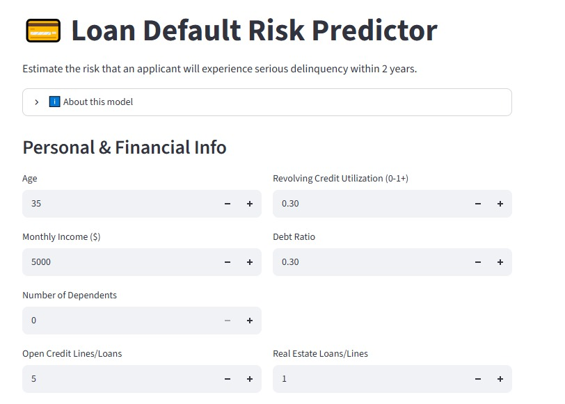
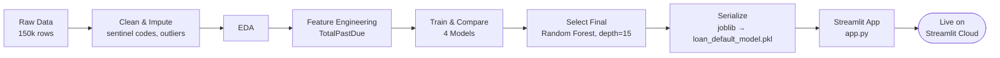

<p align="center">
  
</p>

<div align="center">


**Estimate the probability that a loan applicant will experience serious delinquency within 2 years — from raw, messy bureau data to a live, interactive risk tool.**

[](https://default-risk-ml.streamlit.app/)
&nbsp;📓&nbsp;[**View the Notebook**](Final_CapStone_Project.ipynb)
&nbsp;🎥&nbsp;[**Demo Video**](#) &nbsp;·&nbsp; 💼&nbsp;[**LinkedIn Writeup**](#)

</div>

---

## 📌 Table of Contents
1. [Overview](#-overview)
2. [Live App Preview](#-live-app-preview)
3. [Business Impact & Case Study](#-business-impact--case-study)
4. [The Dataset](#-the-dataset)
5. [Data Cleaning](#-data-cleaning)
6. [Exploratory Data Analysis](#-exploratory-data-analysis)
7. [Feature Engineering](#-feature-engineering)
8. [Modeling & Results](#-modeling--results)
9. [Why Recall Over Accuracy](#-why-recall-over-accuracy)
10. [Deployment Architecture](#-deployment-architecture)
11. [Inference Contract](#-inference-contract)
12. [Tech Stack](#-tech-stack)
13. [Project Structure](#-project-structure)
14. [Run It Locally](#-run-it-locally)
15. [Limitations & Future Work](#-limitations--future-work)
16. [Key Takeaways](#-key-takeaways)

---

## 🎯 Overview

Lenders face one constant, high-stakes question: **will this applicant pay back their loan?** Approve too freely and bad debt piles up. Decline too cautiously and good customers walk away.

This project builds a complete ML pipeline that estimates the probability an applicant will experience **serious delinquency (90+ days late) within the next 2 years**, based on their financial profile and payment history — and ships it as a live, interactive tool anyone can try.

Built as the capstone for the **Neurofive Solutions — Machine Learning Fundamentals** internship, it covers the full workflow end to end: problem definition → messy-data cleaning → EDA → feature engineering → multi-model comparison → deployment as a production-style app.

## 🖥️ Live App Preview

<p align="center">
  
  <br/><sub><i>Add a screenshot of the running app at <code>images/app_screenshot.png</code> to fill this in — everything else below already matches your live app.</i></sub>
</p>

The app is a single-page **Streamlit** tool (`app.py`) split into two sections:

| Section | Inputs |
|---|---|
| **Personal & Financial Info** | Age · Monthly Income · Number of Dependents · Revolving Credit Utilization · Debt Ratio · Open Credit Lines/Loans · Real Estate Loans/Lines |
| **Payment History** | 30–59 Days Late · 60–89 Days Late · 90+ Days Late |

Clicking **Predict Default Risk** runs the model live and returns a color-coded verdict — 🟥 *High Risk* or 🟩 *Low Risk* — with the exact estimated probability shown on a progress bar.

## 📈 Business Impact & Case Study

In credit risk, the two error types are not equally expensive:

- **False Negative** (approving a real defaulter) → direct loss of principal and interest.
- **False Positive** (declining a safe borrower) → only an opportunity cost — the customer takes their business elsewhere, but the lender loses nothing they already had.

Because a missed defaulter is structurally more expensive than a missed good customer, a responsible risk model should be judged on how well it **catches actual defaulters (recall)**, not on raw accuracy. A model that's 94% "accurate" by predicting "no default" for almost everyone isn't cautious — it's blind to the exact cases the business needs flagged. This is the core design decision behind every modeling choice in this project (see [Why Recall Over Accuracy](#-why-recall-over-accuracy)), and it's the difference between a metric that looks good in a notebook and a model that actually protects a loan book in production.

## 📊 The Dataset

| | |
|---|---|
| **Source** | [Give Me Some Credit](https://www.kaggle.com/c/GiveMeSomeCredit) — Kaggle |
| **Size** | ~150,000 records · 11 features |
| **Target** | `SeriousDlqin2yrs` (1 = defaulted, 0 = did not) |

| Feature | Description |
|---|---|
| `RevolvingUtilizationOfUnsecuredLines` | Credit card / credit-line balance relative to limit |
| `age` | Applicant's age |
| `NumberOfTime30-59/60-89/90+DaysLate` | Late-payment counts, by severity |
| `DebtRatio` | Monthly debt payments ÷ monthly income |
| `MonthlyIncome` | Applicant's monthly income |
| `NumberOfOpenCreditLinesAndLoans` | Open credit accounts |
| `NumberRealEstateLoansOrLines` | Mortgages / real estate loans |
| `NumberOfDependents` | Number of dependents |

## 🧹 Data Cleaning

| Issue | Diagnosis | Fix |
|---|---|---|
| **Sentinel codes (269 rows)** | Late-payment columns held values of 96/98 — impossible given the realistic 0–17 range. Identical row counts (5 & 264) repeated across all 3 independent columns confirmed these were leftover placeholder codes, not real data | Dropped affected rows |
| **Invalid age (`age = 0`)** | Clear entry error; rest of the row was normal | Median imputation |
| **Missing `MonthlyIncome` (~20%)** | Right-skewed distribution | Median imputation |
| **Missing `NumberOfDependents` (~2.6%)** | Right-skewed distribution | Median imputation |
| **Extreme `RevolvingUtilizationOfUnsecuredLines`** | Long tail past the realistic 0–1 range | Capped at 99th percentile (**~1.09**) |
| **Extreme `DebtRatio`** | 95th percentile still ~2,452 — driven mathematically by very-low-income applicants, not a small isolated group | Fixed domain cap of **3** (percentile cutoff wasn't safe here) |

## 📈 Exploratory Data Analysis

**Class balance:** 93.4% non-default vs. **6.6% default** — a meaningful imbalance that shaped every modeling decision that followed. Accuracy alone would be misleading on data like this.

<table>
<tr>
<td width="50%" align="center"><b>Age vs. Default Rate</b><br/></td>
<td width="50%" align="center"><b>Late Payments vs. Default Rate</b><br/></td>
</tr>
<tr>
<td>Default rate drops steadily from <b>~11%</b> (ages 18–30) to <b>~2%</b> (ages 70+) — younger applicants are consistently higher risk.</td>
<td>The sharpest signal in the dataset: default rate jumps from <b>~5%</b> (0 late payments) to <b>~34%</b> after just <b>one</b> instance of being 90+ days late.</td>
</tr>
</table>

**Correlation with target:**

| Feature | Correlation |
|---|---|
| `NumberOfTimes90DaysLate` | 0.31 |
| `RevolvingUtilizationOfUnsecuredLines` | 0.28 |
| `NumberOfTime30-59DaysPastDueNotWorse` | 0.27 |
| `NumberOfTime60-89DaysPastDueNotWorse` | 0.27 |
| `age` | -0.11 |
| `DebtRatio`, `MonthlyIncome`, credit-line counts | ~0.00 (negligible) |

## 🛠️ Feature Engineering

The three individual late-payment columns are each moderately correlated with the target — but they're also correlated with *each other*, since a chronically late payer tends to show up across all three severity tiers. A single engineered feature, **`TotalPastDue`** (the sum of all late-payment counts across the three tiers), consolidates that shared signal into one strong predictor.

This feature turned out to be the key to the final deployment decision (see [Deployment Architecture](#-deployment-architecture)) — it let a smaller, shallower Random Forest recover nearly all the performance of a much larger one.

## 🤖 Modeling & Results

Four models were compared on the same held-out test set. Accuracy is computed directly from each model's confusion matrix (below) for full transparency:

| Model | Precision (defaulters) | Recall (defaulters) | F1 | Accuracy | Notes |
|---|:---:|:---:|:---:|:---:|---|
| Baseline Logistic Regression | 0.64 | 0.16 | 0.26 | **93.9%** | High accuracy, but caught almost no real defaulters — the classic imbalanced-classification trap |
| Logistic Regression (class-weighted) | 0.21 | 0.73 | 0.33 | 80.5% | Recall triples, precision collapses |
| Random Forest (class-weighted) | 0.40 | 0.35 | 0.38 | — | Best balance of the first three |
| **Random Forest + `TotalPastDue` (final, deployed)** | **0.28** | **0.59** | **0.38** | **87.1%** | Matches the best F1 with far better recall — tuned for deployability |

<table align="center">
<tr>
<td align="center"><b>Baseline LR</b><br/></td>
<td align="center"><b>Class-Weighted LR</b><br/></td>
<td align="center"><b>Final Random Forest</b><br/></td>
</tr>
</table>

## ⚖️ Why Recall Over Accuracy

In credit risk, **missing a real defaulter (false negative) is typically far more costly** than a false alarm on a safe borrower. The 93.9%-accuracy baseline looked impressive on paper but caught only ~16% of applicants who actually defaulted. Every model choice after that explicitly optimized for **recall on the minority class**, trading some precision and some accuracy for a model that's actually useful to a lender.

## 🚀 Deployment Architecture



The first candidate — a Random Forest with 100 unlimited-depth trees — performed well but serialized to a **~150MB file**, too large to ship comfortably on a free-tier deployment. Constraining `max_depth` to **15** and leaning on the engineered `TotalPastDue` feature recovered almost all the lost signal, landing on a model that matches the larger one's F1 score at a fraction of the file size — the right trade-off for a real deployed app, not just a notebook metric.

## 🔌 Inference Contract

`app.py` loads the model with `joblib.load()` and builds a **plain NumPy array** for prediction — scikit-learn models trained this way have no concept of column names, so the array order below must match the training order *exactly*, or predictions fail silently instead of throwing an error:

```python
input_data = np.array([[revolving_util, age, late_30_59, debt_ratio, monthly_income,
                         open_credit_lines, late_90, real_estate_loans, late_60_89,
                         dependents, total_past_due]])
```

| # | Feature | UI Widget | Range | Default |
|:---:|---|---|---|:---:|
| 0 | `RevolvingUtilizationOfUnsecuredLines` | Revolving Credit Utilization | 0.0 – 2.0 | 0.30 |
| 1 | `age` | Age | 18 – 100 | 35 |
| 2 | `NumberOfTime30-59DaysPastDueNotWorse` | 30–59 Days Late | 0+ | 0 |
| 3 | `DebtRatio` | Debt Ratio | 0.0 – 3.0 | 0.30 |
| 4 | `MonthlyIncome` | Monthly Income ($) | 0+ | 5000 |
| 5 | `NumberOfOpenCreditLinesAndLoans` | Open Credit Lines/Loans | 0+ | 5 |
| 6 | `NumberOfTimes90DaysLate` | 90+ Days Late | 0+ | 0 |
| 7 | `NumberRealEstateLoansOrLines` | Real Estate Loans/Lines | 0+ | 1 |
| 8 | `NumberOfTime60-89DaysPastDueNotWorse` | 60–89 Days Late | 0+ | 0 |
| 9 | `NumberOfDependents` | Number of Dependents | 0+ | 0 |
| 10 | `TotalPastDue` *(engineered, not a widget)* | = 30–59 + 60–89 + 90+ | — | — |

Output: `model.predict_proba()[0][1]` drives the progress bar; `model.predict()[0] == 1` triggers the 🟥 high-risk verdict, using scikit-learn's default 0.5 threshold.

## 🧰 Tech Stack


## 📁 Project Structure

```
Week_6_Capstone/
├── images/                        # EDA & evaluation charts
│   ├── default_rate_by_age.png
│   ├── default_rate_by_late_payments.png
│   ├── cm_baseline_lr.png
│   ├── cm_weighted_lr.png
│   └── cm_final_rf.png
├── Final_CapStone_Project.ipynb   # Full analysis notebook
├── app.py                         # Streamlit app
├── cs-training.csv                # Raw dataset
├── loan_default_model.pkl         # Trained model (joblib-serialized)
├── requirements.txt               # Dependencies
└── README.md
```

## ▶️ Run It Locally

1. Clone the repo: `git clone https://github.com/arhamrizwan2006/neurofive-ml-track.git`
2. Move into the capstone folder: `cd neurofive-ml-track/Week_6_Capstone`
3. Install dependencies: `pip install -r requirements.txt`
4. Launch the app: `streamlit run app.py`

## ⚠️ Limitations & Future Work

- **Training/serving range mismatch:** the app's Revolving Utilization input allows values up to **2.0**, while training data was capped at **~1.09** (99th percentile). Inputs above that range fall outside what the model has seen, and predictions there should be treated with lower confidence.
- **Fixed 0.5 threshold:** the app uses scikit-learn's default decision boundary with no way to adjust the risk cutoff for different lending risk appetites.
- **No explainability surfaced in the app:** the notebook analyzes feature correlation, but the live tool doesn't show *why* a given applicant was flagged (e.g., a SHAP waterfall per prediction would close this gap).
- **Single geography/product dataset:** trained on U.S. bureau-style data — would need re-validation before use on a different market or loan product.
- **No monitoring:** as a static deployment, there's no drift detection if the applicant population changes over time.

## 🔑 Key Takeaways

- Real-world tabular data almost always hides sentinel/placeholder codes disguised as valid values — always check distributions before trusting a column.
- On imbalanced targets, **accuracy is a vanity metric** — recall and F1 on the minority class tell the real story.
- Model selection isn't just about the best metric on paper — a deployed product has to balance performance against file size, latency, and hosting constraints.
- One well-engineered feature (`TotalPastDue`) recovered nearly all the performance lost by constraining the model for deployability.
- A model is only as safe as its input contract — matching the live app's feature order and value ranges to the training pipeline exactly is as important as the model itself.
